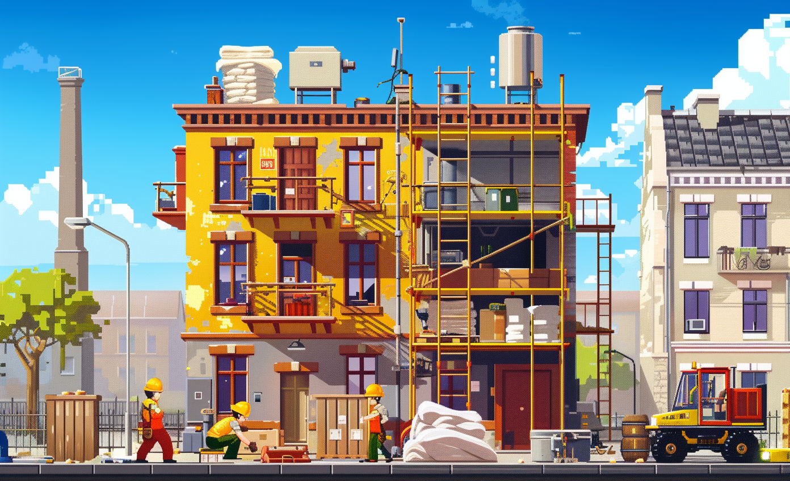

# Real-time LCA Feedback

* LL AARHUS
* LL Enhancing Resource Efficiency: Environmental Impact Feedback for Responsible Building Resource Usage

# GBN elements

| Purpose                  | Issue                               | Scale    |
|:-------------------------|:------------------------------------|:---------|
| Responsible resource use | Living and working environment      | Building |
| Responsible resource use | Innovation, creativity and research | Building |
| Attractiveness           | Education and capacity building     | Building |

# Art

-> [Rules](rules.md)
