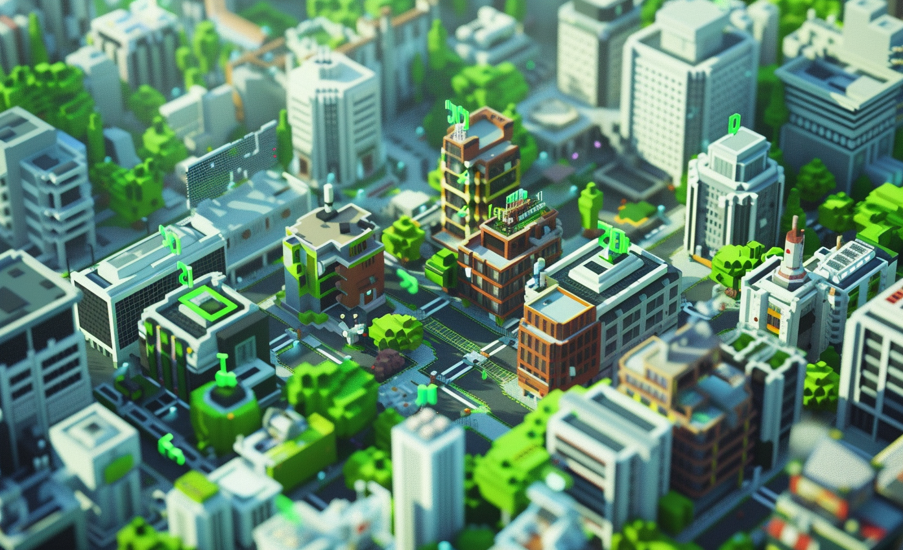

# Post-construction performance 

* LL AARHUS
* LL Building Dialogue: Enhancing Well-being through Empowered Governance

# GBN elements

| Purpose                  | Issue                                  | Scale    |
|:-------------------------|:---------------------------------------|:---------|
| Well-being               | Governance, empowerment and engagement | Building |
| Well-being               | Living and working environment         | Building |
| Responsible resource use | Governance, empowerment and engagement | Building |

# Art

-> [Rules](rules.md)
