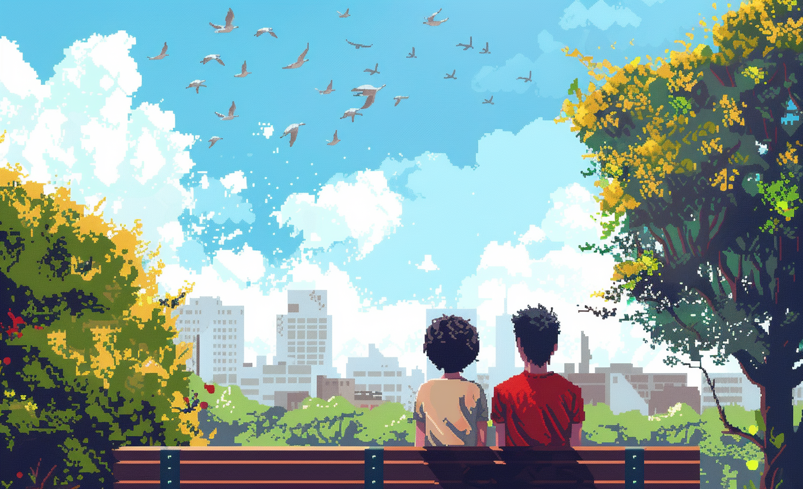

# Birdhouse Biodiversity Engagement

* LL PORTO
* LL Celebrating Diversity for Environmental Preservation and Community Engagement

# GBN elements

| Purpose                                     | Issue                               | Scale    |
|:--------------------------------------------|:------------------------------------|:---------|
| Preservation and improvement of environment | Culture and community identity      | Building |
| Preservation and improvement of environment | Education and capacity building     | Building |
| Well-being                                  | Innovation, creativity and research | Building |

# Art

-> [Rules](rules.md)
