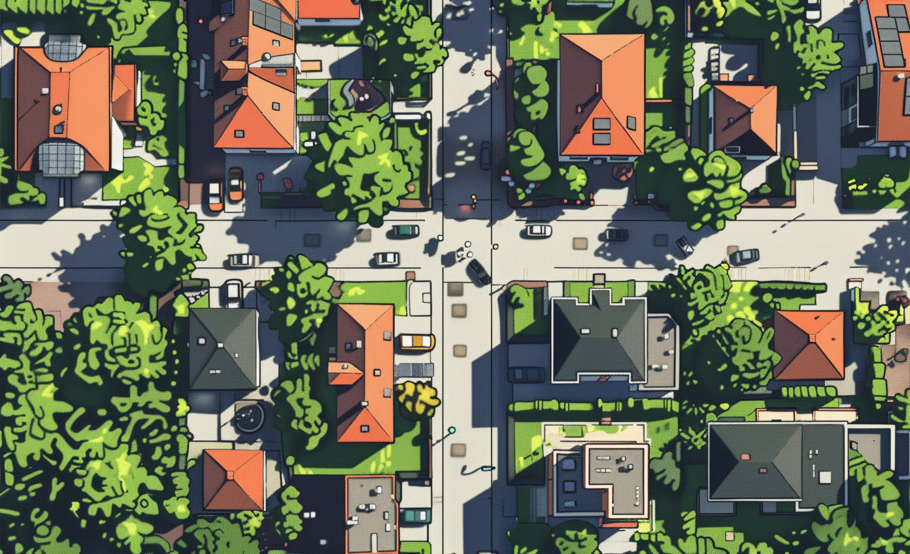

# Energy Community Info Platform

* LL BRUSSELS
* LL Sustainable Resource Education: Promoting Responsible Use and Energy Efficiency

# GBN elements

| Purpose                  | Issue                                  | Scale    |
|:-------------------------|:---------------------------------------|:---------|
| Responsible resource use | Education and capacity building        | Building |
| Social cohesion          | Governance, empowerment and engagement | Building |
| Resilience               | Governance, empowerment and engagement | Building |

# Art

-> [Rules](rules.md)
