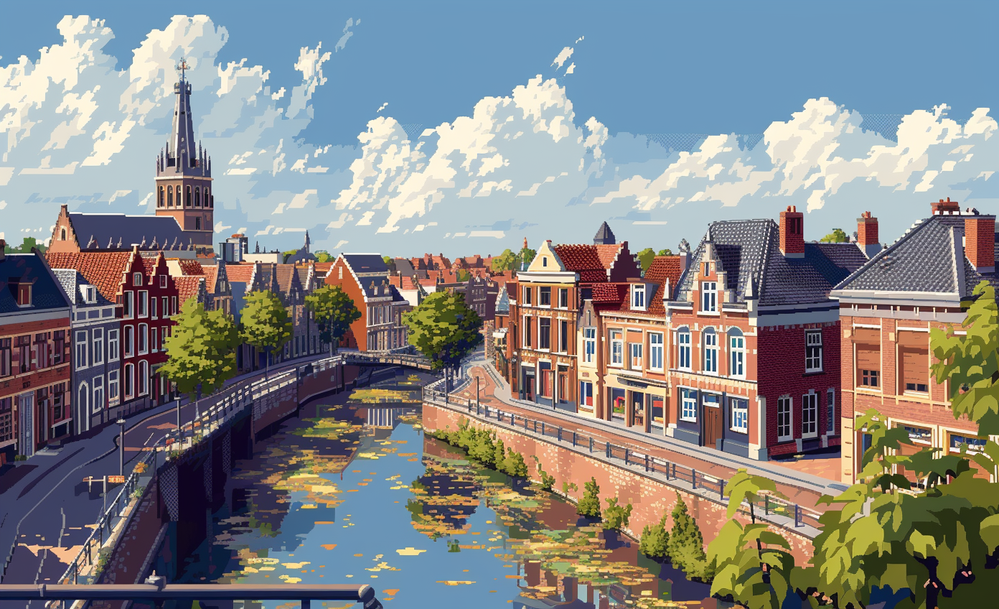

# BRUSSELS

## GBN elements

| Idea                                                                                                                                                                                                        | Purpose                                     | Issue                                              | Scale         |
|:------------------------------------------------------------------------------------------------------------------------------------------------------------------------------------------------------------|:--------------------------------------------|:---------------------------------------------------|:--------------|
| "The lab places an emphasis on innovative  sustainable practices like energy control  mobility  and wellbeing  signifying responsible resource use with applied technology.                                 | Responsible resource use                    | Innovation, creativity and research                | Neighbourhood |
| "The pedagogy of the school encourages social innovation among students and fosters social cohesion in the larger community.                                                                                | Social cohesion                             | Education and capacity building                    | Building      |
| "The living lab school is focusing on empowering stakeholders and encouraging collaborative work toward sustainability  which is a form of resilience planning considering future environmental challenges. | Resilience                                  | Governance, empowerment and engagement             | Building      |
| "By promoting technology and innovation in areas such as energy and mobility  the lab enhances the wellbeing of students and community members.                                                             | Well-being                                  | Innovation, creativity and research                | Building      |
| "Circular economy approaches and sustainable procurement used in the lab hint towards responsible resource use and push to sustainable economy.                                                             | Responsible resource use                    | Economy and sustainable production and consumption | Building      |
| "The Living Lab school is raising awareness and improving education  promoting its attractiveness and potential for innovation.                                                                             | Attractiveness                              | Education and capacity building                    | Building      |
| "Recognition of natural elements in the community emphasizes the preservation and improvement of the environment  enhancing biodiversity and ecosystem services.                                            | Preservation and improvement of environment | Biodiversity and ecosystem services                | Neighbourhood |
| "By fostering a sense of community and working together toward a sustainable future  ACE school promotes social cohesion and mutual respect.                                                                | Social cohesion                             | Living together, interdependence and mutuality     | Neighbourhood |
| "With its focus on sustainable building facilities and operation  the lab is working on improving living and working environment.                                                                           | Preservation and improvement of environment | Living and working environment                     | Building      |

# Art

-> [Rules](rules.md)
