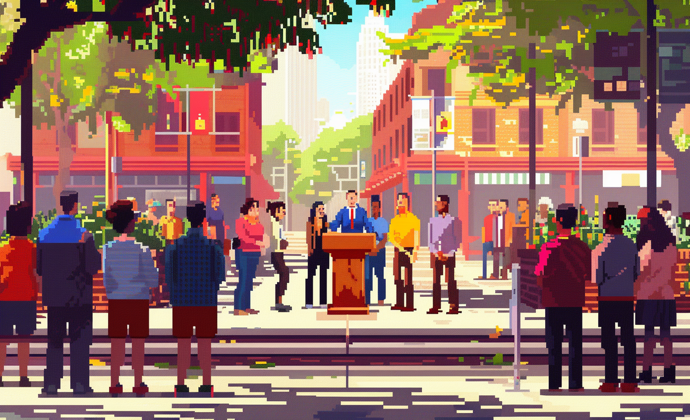

# Community Discovery Event

* LL BRUSSELS
* LL Collaborative Stakeholder Efforts: Fostering Social Cohesion through Sustainable Consumption and Production

# GBN elements

| Purpose         | Issue                                              | Scale         |
|:----------------|:---------------------------------------------------|:--------------|
| Social cohesion | Economy and sustainable production and consumption | Neighbourhood |
| Attractiveness  | Education and capacity building                    | Neighbourhood |
| Social cohesion | Living and working environment                     | Neighbourhood |

# Art

-> [Rules](rules.md)
