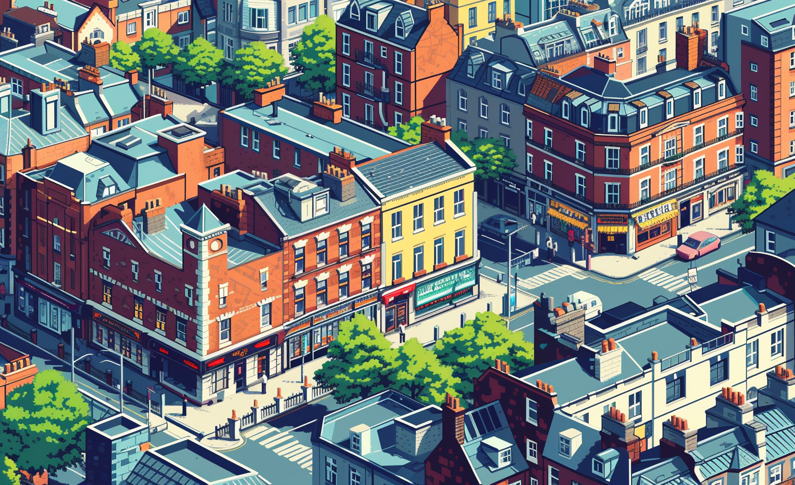

# DUBLIN

## GBN elements

| Idea                                                                                                                                                     | Purpose                  | Issue                                              | Scale         |
|:---------------------------------------------------------------------------------------------------------------------------------------------------------|:-------------------------|:---------------------------------------------------|:--------------|
| "The renewable energy production and storage system  including photovoltaic panels and onsite energy storage  demonstrates responsible use of resources. | Responsible resource use | Community smart infrastructures                    | Neighbourhood |
| "The energy and climate resilience system improves the neighbourhood's resilience to climate change and energy supply risks.                             | Resilience               | Community smart infrastructures                    | Neighbourhood |
| "Promotion of green energy choices supports social cohesion by facilitating shared environmental responsibility.                                         | Social cohesion          | Economy and sustainable production and consumption | Neighbourhood |
| "The Living Lab promotes sustainable production and consumption of energy  which highlights responsible resource use.                                    | Responsible resource use | Economy and sustainable production and consumption | Neighbourhood |
| "Innovation in energy and climate resilience enhances well-being by providing sustainable and eco-friendly living solutions.                             | Well-being               | Innovation, creativity and research                | Neighbourhood |
| "The 'Energy Core' system  embedded in the infrastructure of the Green Building Neighbourhood  enhances economic appeal.                                 | Attractiveness           | Community smart infrastructures                    | Neighbourhood |
| "The Living Lab's energy resilience system mitigates financial and economic shocks  thus improving neighbourhood resilience.                             | Resilience               | Safety and security                                | Neighbourhood |
| "The innovative solution developed by the Living Lab improves the neighbourhood's resilience and preparedness for climate change.                        | Resilience               | Innovation, creativity and research                | Neighbourhood |
| "The Living Lab contributes to resilience by ensuring a stable living and working environment through an innovative energy infrastructure.               | Resilience               | Living and working environment                     | Neighbourhood |

# Art

-> [Rules](rules.md)
