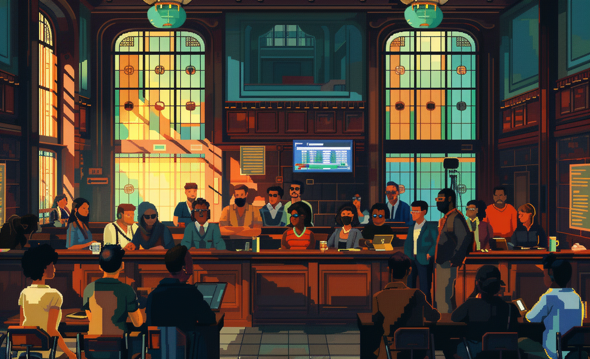

# Geodesign Workshop Planning.

* LL AARHUS
* LL Transforming AU Viborg Campus through Geodesign: Enhancing Attractiveness, Innovation, and Research.

# GBN elements

| Purpose                                     | Issue                                  | Scale    |
|:--------------------------------------------|:---------------------------------------|:---------|
| Attractiveness                              | Innovation, creativity and research    | Building |
| Preservation and improvement of environment | Governance, empowerment and engagement | Building |
| Resilience                                  | Governance, empowerment and engagement | Building |

# Art

-> [Rules](rules.md)
