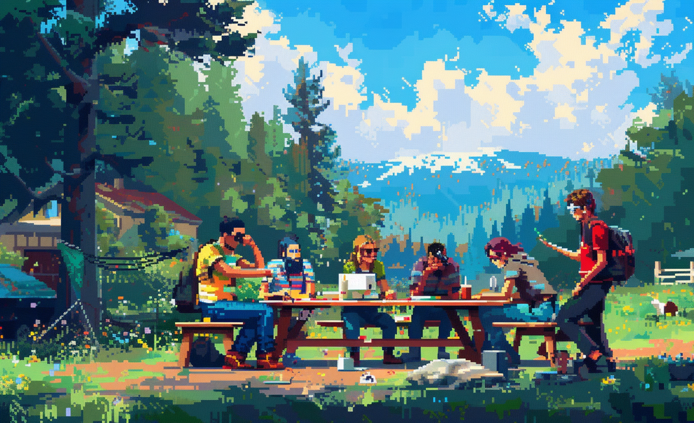

# Geodesign Workshop Success

* LL DUBLIN
* LL Strengthening Communities through Informing and Empowering: Social Cohesion and Capacity Building

# GBN elements

| Purpose         | Issue                                              | Scale         |
|:----------------|:---------------------------------------------------|:--------------|
| Social cohesion | Education and capacity building                    | Neighbourhood |
| Well-being      | Economy and sustainable production and consumption | Building      |
| Resilience      | Innovation, creativity and research                | Neighbourhood |

# Art

-> [Rules](rules.md)
