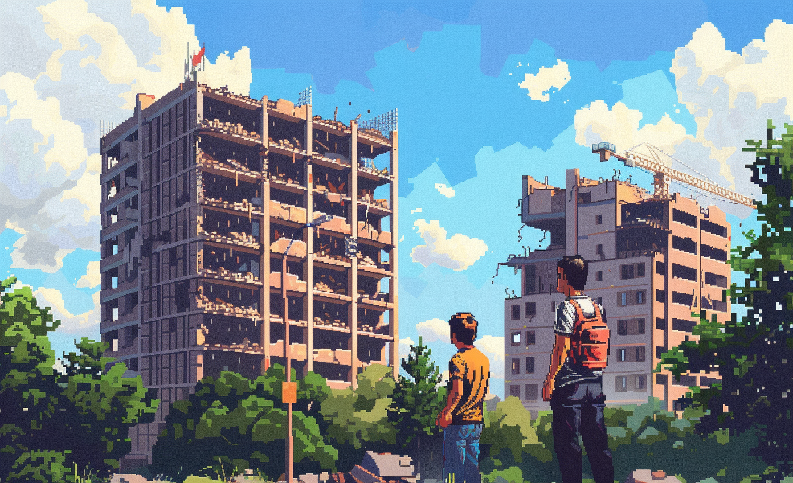

# Demolition planning & optimization

* LL MADRID
* LL Weather-informed demolition: Collaborative decision-making for environmental preservation and governance engagement.

# GBN elements

| Purpose                                     | Issue                                          | Scale    |
|:--------------------------------------------|:-----------------------------------------------|:---------|
| Preservation and improvement of environment | Governance, empowerment and engagement         | Building |
| Preservation and improvement of environment | Innovation, creativity and research            | Building |
| Preservation and improvement of environment | Living together, interdependence and mutuality | Building |

# Art

-> [Rules](rules.md)
