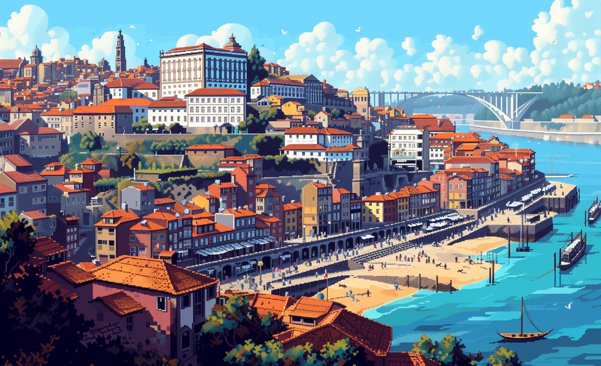

# PORTO

## GBN elements

| Idea                                                                                   | Purpose                                     | Issue                                          | Scale         |
|:---------------------------------------------------------------------------------------|:--------------------------------------------|:-----------------------------------------------|:--------------|
| "Porto Living Lab implementing green energy solutions and promoting renewable energy   | Preservation and improvement of environment | Innovation, creativity and research            | Building      |
| "Educating the community on energy consumption promotes quality-of-life opportunities  | Well-being                                  | Education and capacity building                | Neighbourhood |
| "Capacity building for handling energy consumption contributes to resilience           | Resilience                                  | Education and capacity building                | Building      |
| "Promotion of public transport is an aspect of responsible resource use                | Responsible resource use                    | Mobility                                       | Building      |
| "Creation of knowledge for the community fosters shared experiences                    | Social cohesion                             | Health and care in the community               | Neighbourhood |
| "Involving local actors in sustainability efforts aids environmental preservation      | Preservation and improvement of environment | Governance, empowerment and engagement         | Building      |
| "Promoting biodiversity respects scarcity of natural resources                         | Responsible resource use                    | Biodiversity and ecosystem services            | Building      |
| "Creating natural green spaces promotes social cohesion                                | Social cohesion                             | Living together, interdependence and mutuality | Neighbourhood |
| "Porto Living Lab mobilizes stakeholders for change and promotes technical innovations | Attractiveness                              | Governance, empowerment and engagement         | Building      |

# Art

-> [Rules](rules.md)
