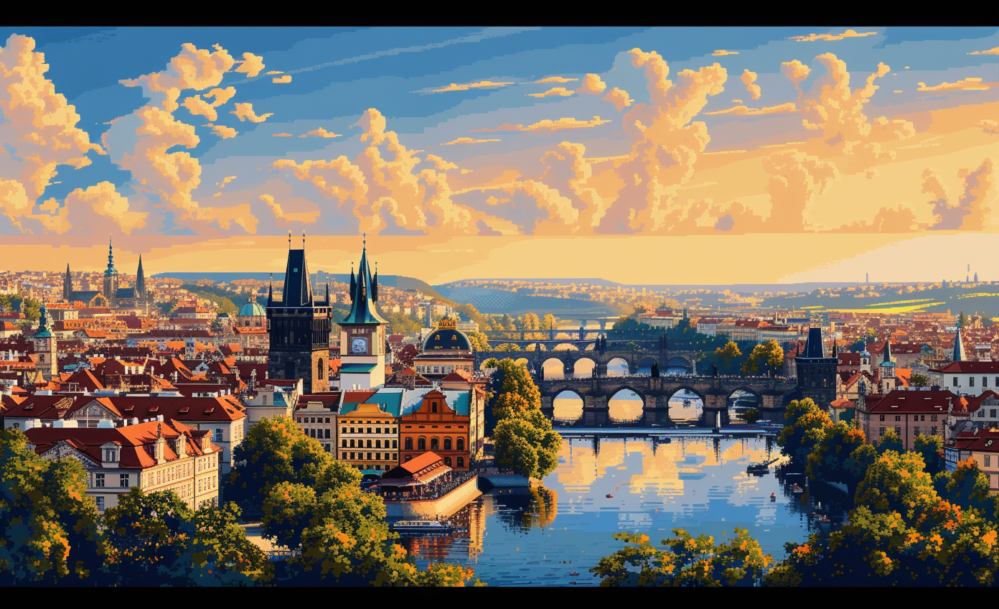

# PRAGUE

## GBN elements

| Idea                                                                                                                                                            | Purpose                                     | Issue                                              | Scale         |
|:----------------------------------------------------------------------------------------------------------------------------------------------------------------|:--------------------------------------------|:---------------------------------------------------|:--------------|
| "The vision of Prague Living Lab focuses on improving economic attractiveness through the development of efficient building solutions and green neighbourhoods. | Attractiveness                              | Living and working environment                     | Building      |
| "GBN application helps in reducing the negative environmental impact and enhances air quality.                                                                  | Preservation and improvement of environment | Living and working environment                     | Building      |
| "The establishment of green building neighbourhood improves the quality of life  promotes health  and overall well-being.                                       | Well-being                                  | Health and care in the community                   | Neighbourhood |
| "Emphasis is given to citizen engagement  showcasing social cohesion through collaborative projects.                                                            | Social cohesion                             | Governance, empowerment and engagement             | Neighbourhood |
| "Green building neighbourhood makes the area more appealing for investments  promoting sustainable production and consumption.                                  | Attractiveness                              | Economy and sustainable production and consumption | Neighbourhood |
| "Improvement in building solutions and neighbourhood strengthens city's resilience and promotes safety.                                                         | Resilience                                  | Safety and security                                | Neighbourhood |
| "Improved quality of life strengthens the community identity and fosters culture.                                                                               | Well-being                                  | Culture and community identity                     | Neighbourhood |
| "Expertise in passive building solutions and smart energy management promotes responsible resource use and high-quality utilities.                              | Responsible resource use                    | Community smart infrastructures                    | Building      |
| "GBN maintains a balance with nature  preserving biodiversity and enhancing ecosystem services.                                                                 | Preservation and improvement of environment | Biodiversity and ecosystem services                | Neighbourhood |

# Art

-> [Rules](rules.md)
