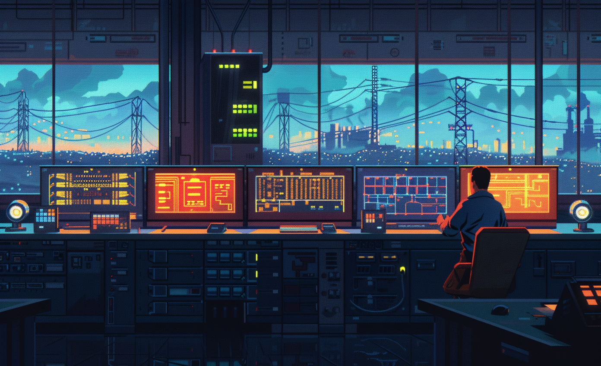

# Monitor electrical power flow

* LL PRAGUE
* LL Ensuring Sustainable Energy: Monitoring, Resource Efficiency, and Smart Community Infrastructures

# GBN elements

| Purpose                  | Issue                                              | Scale    |
|:-------------------------|:---------------------------------------------------|:---------|
| Responsible resource use | Community smart infrastructures                    | Building |
| Responsible resource use | Economy and sustainable production and consumption | Building |
| Resilience               | Community smart infrastructures                    | Building |

# Art

-> [Rules](rules.md)
