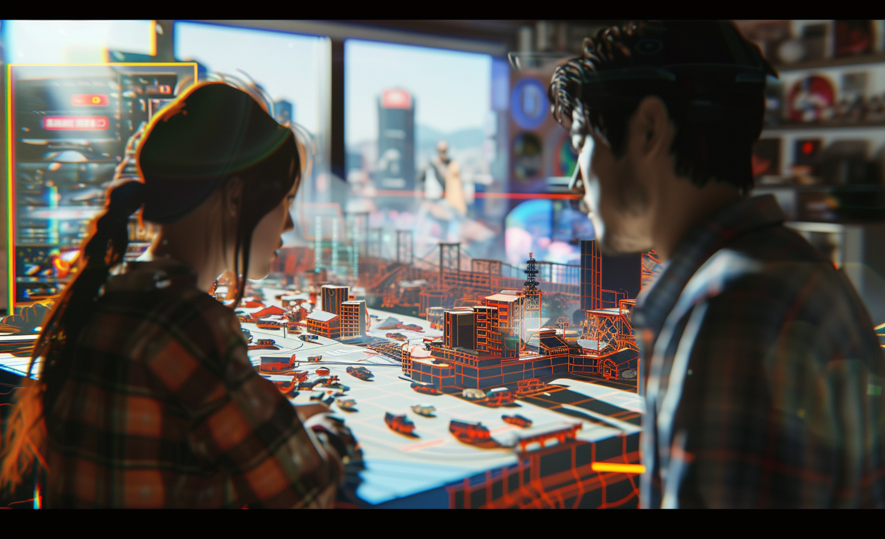

# Energy System Simulation

* LL PORTO
* LL Sustainable Energy System Simulation: Promoting Responsible Resource Use for a Thriving Economy

# GBN elements

| Purpose                  | Issue                                              | Scale    |
|:-------------------------|:---------------------------------------------------|:---------|
| Responsible resource use | Economy and sustainable production and consumption | Building |
| Responsible resource use | Education and capacity building                    | Building |
| Responsible resource use | Community smart infrastructures                    | Building |

# Art

-> [Rules](rules.md)
