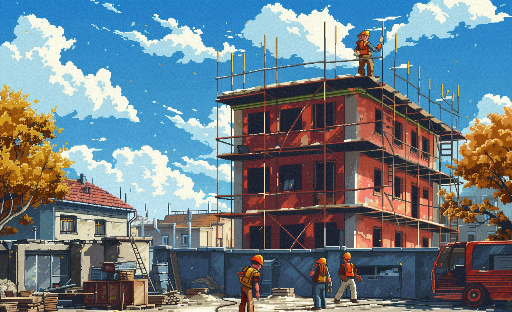

# Recycled Insulation Solutions

* LL PBN
* LL Enhancing Attractiveness: Innovating Low Recyclability Material Applications for Sustainable Living and Work

# GBN elements

| Purpose                                     | Issue                          | Scale    |
|:--------------------------------------------|:-------------------------------|:---------|
| Attractiveness                              | Living and working environment | Building |
| Responsible resource use                    | Living and working environment | Building |
| Preservation and improvement of environment | Living and working environment | Building |

# Art

# Original text Recycled materials for insulation: CIDAUT is committed to the modification of complex and difficult to recycle polymers to obtain construction elements with high added value. These wastes may or may not come from construction and they can enter LLs in two ways:
1- Low density foam from plastic waste: Other polymer with low recyclability is LDPE. Cidaut has worked on the modification of this material to transform it into flexible and low-density foams (100kg/m3). These foams contain a 40% of recycled materials and have excellent thermal and acoustic insulation capacity [1]. Thermoplastic composites from recycled matrices
All sectors are looking for the introduction of thermoplastic composites to replace metals or thermoset composites together with the need to improve the sustainability of products. In this sense, CIDAUT has worked on the modification of multilayer and colored polymeric materials [2],[3], such as PET from food packaging, in order to achieve the appropriate properties to form part of the composites The proposed applications could be:
2- Low density foam from plastic waste: acoustic and thermal insulation for buildings.
Thermoplastic composites from recycled matrices: Structural elements with similar requirements to current aluminum structures in buildings or street furniture. 

-> [Rules](rules.md)
