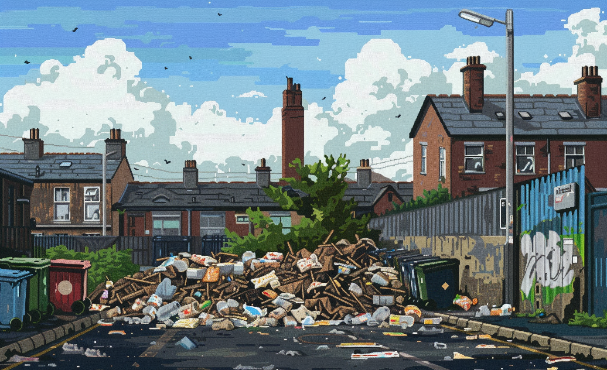

# Unchecked deregulation

* Resources

Insufficient regulation can lead to reduced consumer protection, environmental harm, and the potential for market failures and financial crises. 

# Art

-> [Rules](rules.md)
