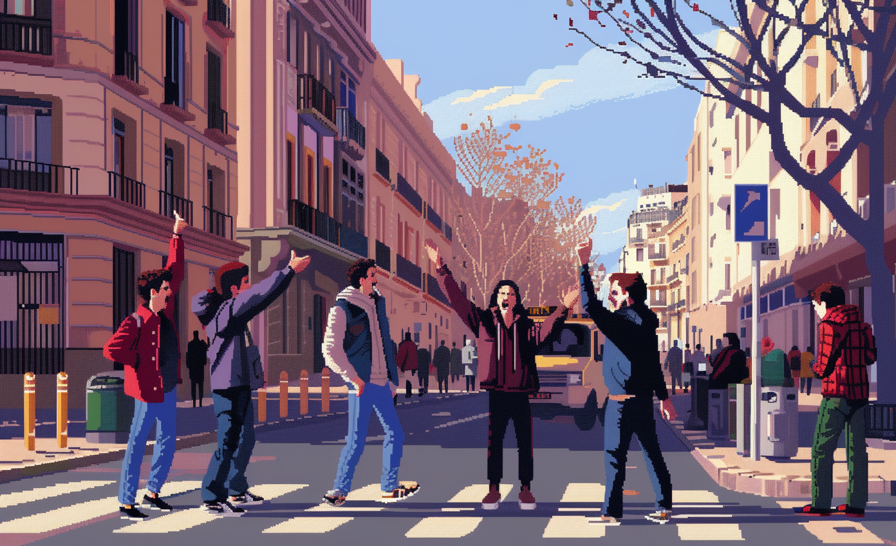

# Polarization and Distrust

* Cohesion

Mutual skepticism and discordant viewpoints become deeply ingrained among individuals or groups, leading to a fragmented community. 

# Art

-> [Rules](rules.md)
