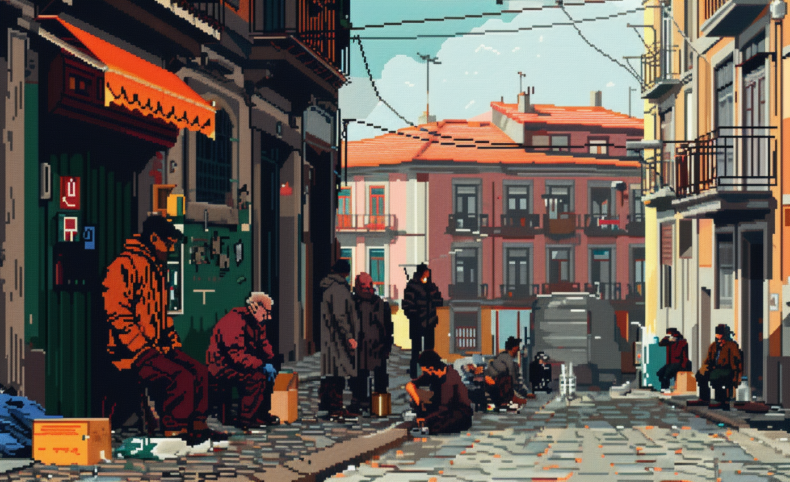

# Economic crisis

* Attractiveness

Period of significant financial turmoil within an economy - sharp decline in economic activities, widespread unemployment, a drop in consumer spending, inflation, or deflation. The repercussions of an economic crisis can be severe, leading to loss of livelihoods, increased poverty, reduced access to essential services, and social unrest.

# Art

-> [Rules](rules.md)
