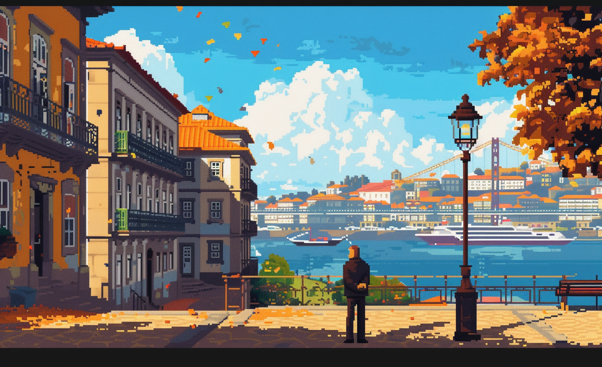

# Developers

* Attractiveness

Urban project developers enhance the attractiveness of cities by designing and constructing innovative spaces that blend functionality with aesthetic appeal, creating vibrant environments that draw residents and visitors alike. They focus on developing amenities, green spaces, and infrastructure that improve the quality of urban life, making GBNs to live, work, and play.

# Art

-> [Rules](rules.md)
